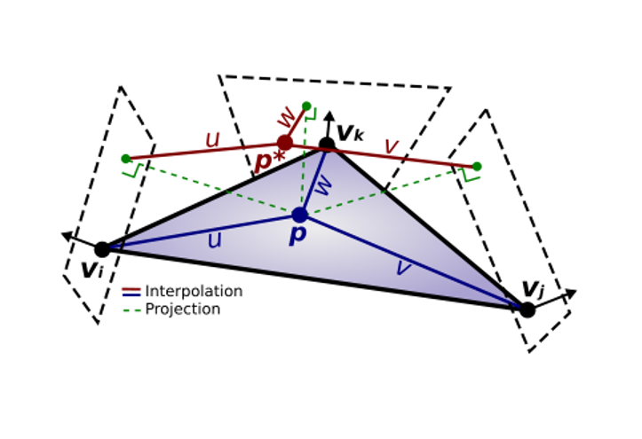
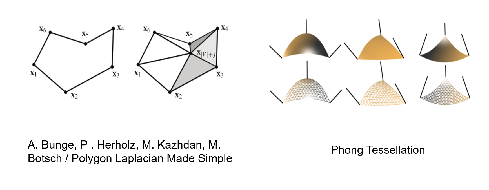

# phong laplacian 

## The idea the project: use the smaller information from the mesh, but get the stronger laplacian. use the phong tessellation from [Tamy Boubekeur Marc Alexa](https://perso.telecom-paristech.fr/boubek/papers/PhongTessellation/PhongTessellation.pdf) and the paper from  [Bunge, Herholz, Kazhdan, Botsch, Polygon Laplacian Made Simple, Eurographics 2020.](https://diglib.eg.org/items/9f4d34b4-23b4-4e54-b3c2-921d18ab5a85)

 

The vertices interpolated by the Phong method are used to obtain the virtual vertices in the Laplacian method.

Desired results：the phong laplacian of a mesh is more similar to the ordinary laplacian after refinement. So the phong laplacian has more informaition than the ordinary laplacian

However, the weights of the virtual vertices of the Laplace method are on the plane and cannot represent the vertices of the phong tessellation. This is the fundamental reason for the failure of the phong tessellation construction.

## Although it is a failed project, I hope this project can provide some help to researchers working in this field.

## This project is implemented by VS Windows10. The release folder contains the executable file of this project. In order to verify the effectiveness of laplacian, the src folder has more operations such as deformation.
